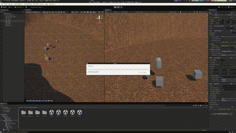

# Practise Unity-Physics

## Index

- [Practise Unity-Physics](#practise-unity-physics)
  - [Index](#index)
  - [First part](#first-part)
    - [Situation 1:](#situation-1)
    - [Situation 2:](#situation-2)
    - [Situation 3:](#situation-3)
    - [Situation 4:](#situation-4)
    - [Situation 5:](#situation-5)
    - [Situation 6:](#situation-6)
    - [Situation 7:](#situation-7)
    - [Situation 8:](#situation-8)
    - [Situation 9:](#situation-9)
  - [Second part](#second-part)
    - [Exercise 1:](#exercise-1)
    - [Exercise 2:](#exercise-2)
    - [Exercise 3:](#exercise-3)
    - [Exercise 4:](#exercise-4)
    - [Exercise 5:](#exercise-5)

## First part

### Situation 1:

In this situation we see that the cube has the rigidbody and nothing move.

### Situation 2:

In this situation we see that the cube has the rigidbody and the sphere and both collide.

### Situation 3:

We see that if the sphere is kinematic it doesn't move because kinematic objects are not affected by physics forces.

### Situation 4:

In this situation we put that the plane has a rigidbody and it fall down. Also a plane to be a rigidbody needs to be convex.

### Situation 5:

In this situation only add more mass to the sphere and it don't change anything. Because the gravity is not affected by the mass.

### Situation 6:

More mass for the sphere but how I said before it don't change anything.

### Situation 7:

How is all falling down it not see very well but if the plane is kinematic we can see that the sphere behave like in ice.

### Situation 8:

In this case the sphere has trigger and no rigidbody so it doesn't behave like a physical object. This Trigger option
is used to detect when other objects enter, exit, or stay within a defined area without applying physical forces.

### Situation 9:

In this case the sphere has trigger and rigidbody so it behave like a physical object but also detect when other objects enter, exit, or stay within a defined area without applying physical forces.

## Second part

### Exercise 1:

In this exercise I programm a code to make the cube move with the arrow keys or WASD keys. See the code [here](Assets/Scenes/second%20part/scripts/Movement.cs).

### Exercise 2:

There's several cubes and spheres that are kinematic and when the player hit them they change their color. See the code [here](Assets/Scenes/second%20part/scripts/Movement.cs), [here](Assets/Scenes/second%20part/scripts/CollisionDetecter.cs). For debug reason I made the [this]

### Exercise 3:

In this exercise I created two zones, one that increase a public variable "damage" and the second that change the color of the player only when it enter and exit the zone. See the code [here](Assets/Scenes/second%20part/scripts/Movement.cs), [here](Assets/Scenes/second%20part/scripts/Trigger/ChangeColor.cs) and [here](Assets/Scenes/second%20part/scripts/Trigger/MoreDamage.cs).

### Exercise 4:

In this exercise I created several cylinders that symbolize the collectionables items and the spheres that are the enemies. You can touch the enemies but if you touch the cylinders you go through them. See the code [here](Assets/Scenes/second%20part/scripts/Movement.cs), for debugging reason I made [this](Assets/Scenes/second%20part/scripts/CheckLayerCollision/Checker.cs) code. 

### Exercise 5:

In this exercise we can see the difference between different physic materials when we press the key X. The green sphere is bouncy, the red one is slippery and the black one is rough. See the code [here](Assets/Scenes/second%20part/scripts/Movement.cs) and if you want to see the materials check [here](Assets/Scenes/second%20part/physics%20material/).