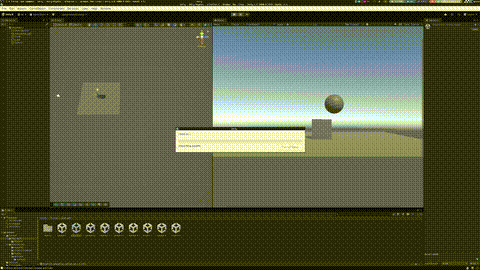

# Practise Unity-Physics

## First part

### Situation 1:

In this situation we see that the cube has the rigidbody and nothing move.

### Situation 2:

In this situation we see that the cube has the rigidbody and the sphere and both collide.

### Situation 3:

We see that if the sphere is kinematic it doesn't move because kinematic objects are not affected by physics forces.

### Situation 4:

In this situation we put that the plane has a rigidbody and it fall down. Also a plane to be a rigidbody needs to be convex.

### Situation 5:

In this situation only add more mass to the sphere and it don't change anything. Because the gravity is not affected by the mass.

### Situation 6:

More mass for the sphere but how I said before it don't change anything.

### Situation 7:

How is all falling down it not see very well but if the plane is kinematic we can see that the sphere behave like in ice.

### Situation 8:

In this case the sphere has trigger and no rigidbody so it doesn't behave like a physical object. This Trigger option
is used to detect when other objects enter, exit, or stay within a defined area without applying physical forces.

### Situation 9:

In this case the sphere has trigger and rigidbody so it behave like a physical object but also detect when other objects enter, exit, or stay within a defined area without applying physical forces.